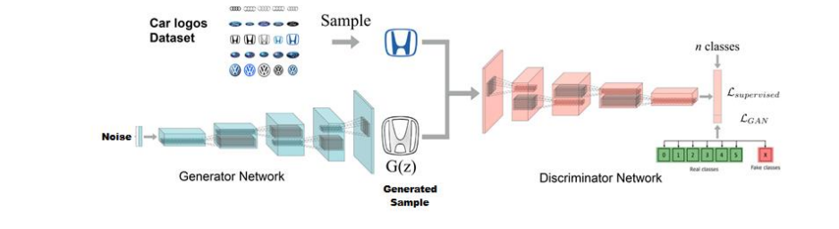

# Generating synthetic images using GANs

Generative Adversarial Networks(GANs) are composed of two neural networks competing with each other, one that generates samples from noise and another which concludes whether the generated samples are a good approximation of some real data that it has been trained on. In this project we attempt to replicate the process of generating artificial images with a Generative Adversarial Network. Ours is a vanilla GAN with a stacked structure (based on StackGAN). We use a dataset of webscraped images containing different automobile logos. The Scraper.py program makes use of beautifulSoup and selenium to extract a preset number of images from Goole to assemble a dataset of 1000 stock images for each logo. With 23 different logos, we perform data augmentation and image processing before feeding these images to our network.  Complete details can be found in the [project report](https://github.com/jsully1996/AI_Projects/blob/master/Synthetic_Image_Generation_with_AC-GANs/report.pdf).

## Dependencies  
```
Tensorflow (1.0+)
BeautifulSoup4
OpenCV
Numpy
Python 3+
```
## Usage
```
Scrape images to 'data' Folder:
>>>python3 Scraper.py search_term num_images
eg. python3 Scraper.py BMW logo 100

Resize images before feeding to generator
>>>python resize.py

Script for Data Augmentation
>>>python Augmentate.py <image dir> <transform1> <transform2> ...
eg. python Augmentate.py ../data/bmw_logo fliph flipv noise rot trans

Convert 4D image to 3D eg. RGBA to RGB
>>>python reduce_dim.py

Execute file with Python 3+
>>>python logo_gen.py
```


## Data Collection and Augmentation
Our dataset is composed of 23 classes, each corresponding to a different type of car logo. each class comprises 1000 stock images of varying resolutions and vectors. The decision of using car logos as a base dataset was because we felt it was probably a hitherto unexplored approach. 4 channel and 3 channel images alike were scraped and then reduced to an RGB (3 channel) format.  We had to perform a lot of manual filtering and cleaning of individual images for each class because the logo images were mixed with images of entire cars featuring logos on them, graphically edited logos or even entirely unrelated images that were merely scraped due to the matching search term. Doing this would ensure that only relevant and structurally sound pictures would be fed to the GAN. The images are then resized to a 256x256 standard before being fed to the network.
<br>

To increase the number of training examples, we also perform rudimentary data augmentation. The <a href='./Augmentate.py'>Augmentation.py</a> tool scans a directory containing image files, and generates new images by performing a specified set of augmentation operations on each file that it finds. This process multiplies the number of training examples that can be used when developing a neural network, and should significantly improve the resulting network's performance, particularly when the number of training examples is relatively small. One or more transform arguments determine what types of augmentation operations will be performed, using the codes listed in the table below:
|Code|Description|Example Values|
|---|---|------|
|`fliph`|Horizontal Flip|`fliph`|
|`flipv`|Vertical Flip|`flipv`|
|`noise`|Adds random noise to the image|`noise_0.01`,`noise_0.5`|
|`rot`|Rotates the image by the specified amount|`rot_90`,`rot_-45`|
|`trans`|Shifts the pixels of the image by the specified amounts in the x and y directions|`trans_20_10`,`trans_-10_0`|
|`zoom`|Zooms into the specified region of the image, performing stretching/shrinking as necessary|`zoom_0_0_20_20`,`zoom_-10_-20_10_10`|
|`blur`|Blurs the image by the specified amount|`blur_1.5`|

## Working
The discriminator is a  multi-class classifier that takes a tiny portion of labeled data and a much larger amount of unlabeled data from the same data source. Pertaining specifically to our problem, the discriminator would be a classifier for 24 classes with 1 neuron (R/F neuron) representing the fake data output (from the Generator) and the other 23 representing real data with classes. The discriminator needs to work with the following:
* Adjust Real/Fake neuron output label = 0, when receiving real unsupervised data
* Adjust Real/Fake neuron output label= 1, when receiving fake unsupervised data
* Adjust Real/Fake output label = 0 and corresponding label output = 1, when receiving real supervised data.
 This combination of different sources of data help the discriminator classify more accurately than, if it had been only provided with a portion of labeled data.

All generative models are probabilistic in nature. When we ask a generative model to generate a sample say an image, we are simply sampling from a probability distribution. This means that if we can compare the probability distributions of our Generator and that of our original data then we will have an evaluation metric. A kernel function can be used to define these probability distributions more accurately. We used Keras on Tensorflow to implement an AC-GAN(unoptimized). We acquired the base code from an open source project which implements the referenced paper[4] by Augustus Odena from Google Brain. WE train our network conditioned on class with Adam optimizer for 2000 epochs. The high number of epochs compensates for the lesser amount of samples and we have a batch-size of 64(A matrix of 8x8 image samples). We changed the base code in a number of ways by adding new layers and altering several others. The detailed information is as follows :

### Generator:
* Upscaled noise vector to 128*128*3
* Formed a weight vector from gaussian distribution having a standard deviation of 0.02
#### Layer1:
* Transpose convolution with kernel size 5x5 and strides 2,2 generating a matrix of 8*8*256
* Batch normalisation with epsilon=1e-5, decay = 0.9
* ReLU activation function to stabilise the output of each layer.
#### Layer2: Transpose convolution with kernel size 5x5 and strides 2,2 generating a matrix of 16*16*128
#### Layer3: Transpose convolution with kernel size 5x5 and strides 2,2 generating a matrix of 32*32*64
#### Layer4: Transpose convolution with kernel size 5x5 and strides 2,2 generating a matrix of 64*64*32
#### Layer5:
* Transpose convolution with kernel size 5x5 and strides 2,2 generating a matrix of
128*128*3
* Tan(h) activation function.
### Discriminator:
* Layer1:
* Convolution of input matrix to generate 64*64*3 matrix
* Each convolution layer is followed by a batch normalisation layer having epsilon=1e-5, decay = 0.9 except the output layer.
* Similarly, each convolution layer is followed by a Leaky ReLU activation function
#### Layer2: Convolution of input matrix to generate 128* 128*3 matrix
#### Layer3: Convolution of input matrix to generate 256*256*3 matrix
#### Layer4:
* Convolution of input matrix to generate 512*512*3 matrix
* After this the matrix is multiplied with a weight matrix taken from the normal distribution with
standard deviation = 0.02
* The logits generated are passed through a sigmoid function

## Enhancements
We address some of the ways in which our model could possibly fail and introduce possible solutions to
achieve convergence:
* Feature Matching: The logical thing to do while designing a GAN is to aim for a cost function such that the generator finds the best image which can be classified by the discriminator as real. However, while both generator and discriminator keep optimizing by competing against one another, the model might never converge due to the adversarial nature of the model. Feature matching changes the cost function for the generator to minimizing the statistical difference between the features of the real images and the generated images. For this model, we shall measure the L2-distance between the means of their feature vectors. The new cost function is given by:  
<center></center>
* Minibatch Discrimination: This problem is solved by default in AC-GANs because the generator and discriminator are both conditioned on class from the beginning.
* One sided label smoothing: In general, deep networks use very few features to classify an object. If the discriminator depends on a small set of features to detect real images, the generator may just produce these features only to exploit the discriminator. To avoid this, we penalize the discriminator when the prediction for any real images goes beyond 0.9 i.e. (D(real image)>0.9). In other words, we change our target label value to be 0.9 instead of 1.0.
* Balancing discriminator/generator loss: We experiment by maintaining a 3:1 ratio between the number of the gradient descent iterations on the discriminator and the generator. The problem could be solved by a cost function that does not have a close-to-zero gradient when the generator is not performing well. 

##  Problems faced
* The biggest problem we faced was lack of proper resources for training our dataset. We did not have dedicated
GPUs on our systems but were provided with a cloud GPU by the school. However, it was limited in its capabilities
and very slow due to several people training their models on it at once and each user was allocated a mere 8% of the
total 12GB memory.
* A lot of images in our dataset were unusable, so we had to do some manual filtering and refining, discarding
outliers and hence this step was also very time consuming.
* We faced mode collapse situation with the SSL-GAN where all the images being generated looked the same and
only a few classes were being generated.
* The generator and discriminator networks got stuck at a checkpoint after which there were no further changes in
the images being generated.
* Feature matching: As described by the research papers we read, we implemented features at the intermediate
layers in the discriminator to match for real and fake images and make a supervisory signal to train the generator.
We found training only based on this feature matching metric ineffective by itself contrary to what is mentioned in
the paper - the discriminator attains almost zero loss right at the beginning.


