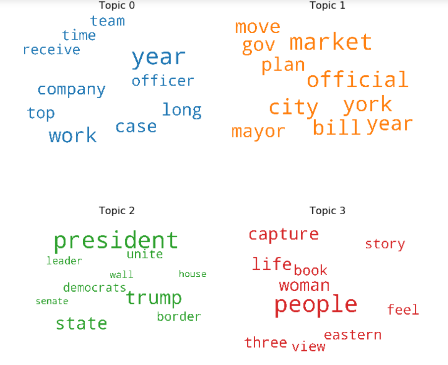
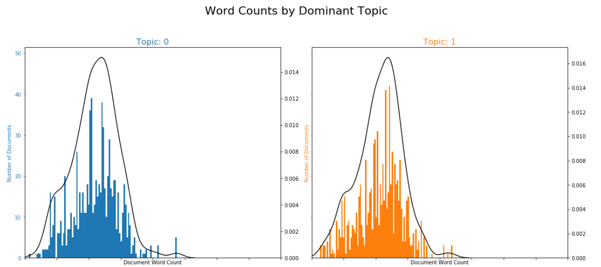
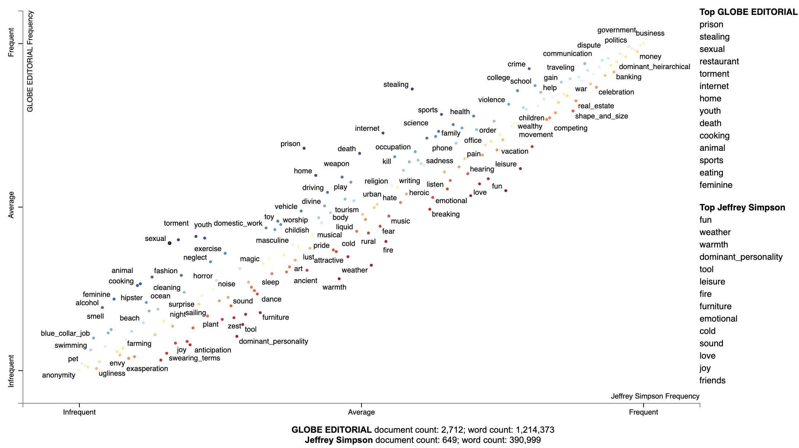
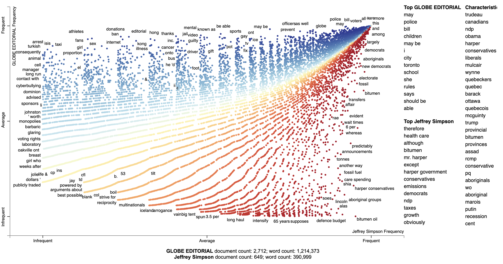
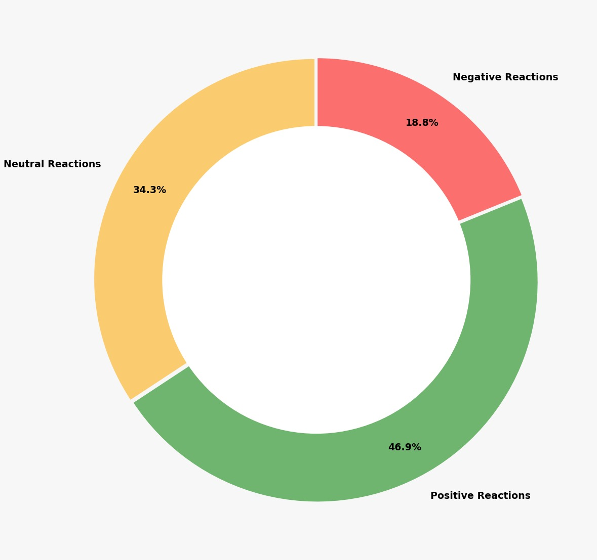

# AVATAЯ - Assessment and Visual Analysis of Trends using Article Яeviews


In the age of Big Data, an estimated 2.5 quintillion bytes of data is generated every day and a huge amount of this is of a textual nature. With scores of documents available on the web and more pouring in day after day, how can one make sense of a general summary without actually diving in and reading every word? Searching for insights from such an enormous amount of  information can become very tedious and time-consuming.

Imagine that you have a massive amount of text and wanted to quickly understand the general trends, topics, or themes that it contains. This concept can take any form such as having to read a huge book (pdf document) or perhaps going through user feedback and comments at work. Fortunately, there exists a solution to this scenario called topic modelling.

Consider a real world example : a book store vendor receives a set of new books for his store and as per policy, must segregate books according to their genre across the shop. For example : Fiction, Fantasy, Romance etc. In some cases, one could get an idea of the genre by looking at a summary or even the title itself. However, when this is not possible, the vendor would have to read at least some part of the book in order to understand what it is about. However, with topic modelling, a book could be summarized automatically and in a negligible amount of time thus enabling it to be sorted efficiently. The same scenario works in a digitized world too. For instance, the book store is replaced by a book selling website and the books themselves would be text documents such as pdfs.

Topic modeling is a type of unsupervised machine learning that makes use of clustering to find latent variables and structures in textual data. In short, it is an approach for finding topics or themes across large amounts of text. Topic modeling is great for document clustering, information retrieval from unstructured text, and feature selection. A topic model is a type of algorithm that scans a set of documents (also known as a corpus), examines how words and phrases co-occur in them, and automatically “learns” groups or clusters of words that best characterize those documents. 

For our project, we perform topic modelling on news articles. There are several influences behind this choice of documents. For one, news articles are extremely abundant online. It is estimated there are approximately 2 million news stories being released onto the internet every day. Besides, there are a wealth of user comments and opinions on these sites that also allow us to perform sentiment analysis in order to better understand these news topics and analyze relations between them.

## Prerequisites
Install Apache Spark 2.3+
Install Python 3.4 or higher and run:

```
$ pip install scattertext
```
Also install jieba, spacy, empath, astropy, gensim and umap-learn in order to make Scattertext run properly.

After installation download the spaCy statistical pretrained model.	
```
$ python -m spacy download en_core_web_lg
```

## Running Instructions
### Topic Modelling
A topic model is a type of statistical model for discovering the abstract topics that occur in a collection of text documents. Topic modeling is a frequently used for text-mining and discovering hidden semantics in text documents. Topic modeling is the process of identifying topics in a set of documents. This can be useful for search engines, customer service automation, and any other instance where knowing the topics of documents is important. 

1) Before running the code, sign up for an NYT Developer account at https://developer.nytimes.com/. Add the key as an environment variable in your Linux environment under the variable name 'my_key'. This code will run for a very long time. It is recommended to be run in Google GCP environment.

```
python  extract_nyt_articles.py
```
2) MongoDB needs to installed before running this step. Follow this link to install MongoDB on your computer, https://docs.mongodb.com/manual/tutorial/install-mongodb-on-ubuntu/. And, PYSPARK_DRIVER_PYTHON=jupyter needs to be changed to PYSPARK_DRIVER_PYTHON=python. Otherwise the program won't run. Again, this code will run for a very long time and it is recommended to be run in Google GCP environment. Make sure "stopwords.txt" is present in the folder where this code resides.

```
spark-submit --packages org.mongodb.spark:mongo-spark-connector_2.11:2.4.0 clean_load_nyt_articles.py
```

3) We are creating two topic modelling models LDA and LSI.
To create the LDA model, run the below command 

```
spark-submit --packages org.mongodb.spark:mongo-spark-connector_2.11:2.4.0 create_lda_model.py
```

4) And, to create the LSI model, run the below command 

```
spark-submit --packages org.mongodb.spark:mongo-spark-connector_2.11:2.4.0 create_lsi_model.py
```
5) To view the top topics of both the models, run

```
spark-submit --packages org.mongodb.spark:mongo-spark-connector_2.11:2.4.0 print_topics.py
```
6) Visualization on Jupyter Notebook

Run the Jupyter Notebook using to view the visualizations
```
pyspark --packages org.mongodb.spark:mongo-spark-connector_2.11:2.4.0
```

7)Load data into mongoDB
```
spark-submit load_data.py socc_comments.csv
```

8)Some more visualizations for LSI and LDA models along with generation of keyword file with LDA
```
python lda_lsi_keywords token_file.csv
```


### Named Entity Recognition

Named Entity Recognition (NER) is a process where an algorithm takes as input a string of sentence or paragraph and extracts relevant entities which can be a place, a person or an organisation. We have performed NER on SOCC dataset.


1) Start by executing "clean_articles.py" which will take as input the articles csv "gnm_articles.csv". Once the execution stops you would get a csv "cleaned_articles.csv".
```
python clean_articles.py
```

2) Next execute "Articles_Entity_Tagger.py". This would start tagging the entities in the "cleaned_articles.csv" file. This may take a while depending on your system configuration. Output would be two files: "articles_top_in_cat.csv" & "tag_counts.csv" which are used in Tableau for visualisations.
```
python Articles_Entity_Tagger.py
```

3) For comments csv execute "Comments_NER_tagger.py" which will take as input "gnm_comments.csv" & output "comments_NER.csv". This will take a while to run. The resulting CSV has been used in Tableau.

```
python Comments_NER_tagger.py
```

4) Execute "Characteristic_visualisation.py", "Gensim_Similarity_Top_2_Authors.py" & "Visualize_Term_Association.py". These will result in the *HTML output files which will take a while to load on Chrome and Safari.* These are interactive visualisations. You can enter a search term and get the relevant articles. Screenshots of these visualisations have also been provided.

```
python Characteristic_visualisation.py
python Gensim_Similarity_Top_2_Authors.py
python Visualize_Term_Association.py
```
5) Tableau dashboards and other visualisations are present in the "output" folder.


### Sentiment Analysis

We perform  this step to by mining the document in a contextual manner by identifying and extracting subjective information in source material, in order to understand the social sentiments behind articles and alse to analyse user comments for each article in order to get an objective sense of their reactions.

1) Start by extracting User comments from the "NYTimes Developer Community" API 
```
python comment_extractor_custom.py year(Enter a year from which to start scraping comments) output_file.csv
```
Alternatively you can run either of the following commands on the command line in order to scrape articles from 1852-present or 2014-present respectively.
```
python comment_extractor_all.py output_file.csv
python comment_extractor.py output_file.csv
```

2) Next execute the following command in order to clean and tokenize the comment snippets.
```
spark-submit clean_comments.py input_file.csv output_file.csv (where input is the file containing snippets i.e. output from comment_extractor and output is the tokenized csv file)
```

3) Get frequency plot of words associated with strongest sentiments.
```
python get_wordfrequency.py tokenized_file.csv
```

4) Get plot of polarities and subjectivities.(See report for further explanation)
```
python polarity_plot.py snippet_file.csv(do not give the tokenized file here)
```

5)Get plot of sentiment count as a donut chart.
```
python sentiment_count.py snippet_file.csv
```

Visualizations for this part have been performed using Matplotlib and can be seen in the 'outputs' folder.

## Visualizations

1) Topic Modelling - Top 4 Topics WordCloud



2) Topic Modelling - Word Count by Dominant Topic



3) Named Entity - Top 2 Authors Empath Topics



4) Named Entity - Top 2 Authors Term Visualisation



5) Visualizing People Reactions



## Authors

* **Padmanabhan Rajendrakumar** - *rajendra@sfu.ca*
* **Jamshed Khan** - *jsully@sfu.ca*
* **Jaideep Misra** - *jmisra@sfu.ca*